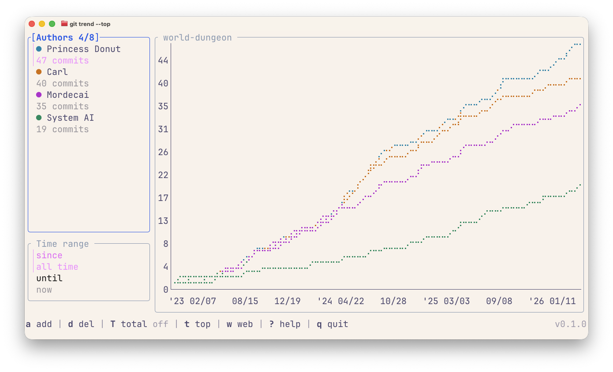
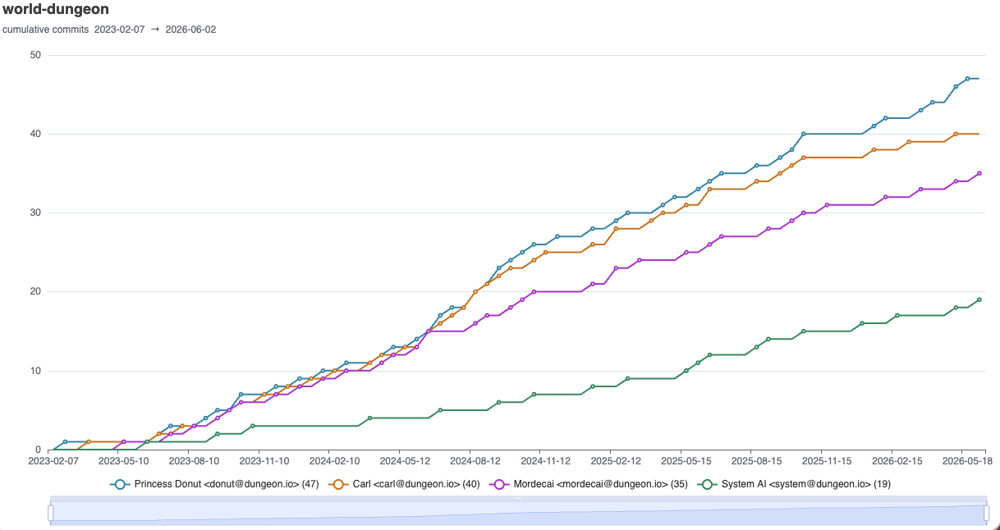

# git-trend

Plots git commit history by author in the terminal. Run `git trend` in any
repo, add authors, set a date range, and the chart updates as you go.

The binary is named `git-trend`, so git picks it up as `git trend` once it's
on your `PATH`.

## TUI



Launch it with no arguments in any git repo:

```
git trend
```

| Key          | Action                                                           |
| ------------ | ---------------------------------------------------------------- |
| `a`          | Add an author (name/email substring)                             |
| `d`          | Remove the selected author / clear the selected time range row   |
| `D`          | Clear all authors                                                |
| `t`          | Fill remaining slots with the top contributors                   |
| `m`          | Add yourself (`git config user.email`)                           |
| `T`          | Toggle the cumulative total line                                 |
| `s`          | Edit the since date                                              |
| `u`          | Edit the until date                                              |
| `j / k`      | Move down / up within the focused panel                          |
| `h / l`      | Switch focus between panels                                      |
| `Enter`      | Edit the focused time range row; confirm text input              |
| `w`          | Open the chart in the browser (writes to a temp file in $TMPDIR) |
| `e`          | Export the chart to `git-trend.html`                             |
| `?`          | Show all keybindings                                             |
| `q / Ctrl+C` | Quit                                                             |

Up to 8 author lines can be shown at once (one per palette color).

## CLI flags

Pass flags to pre-load the TUI or skip it entirely.

```sh
git trend                                          # open TUI
git trend --author alice                           # TUI pre-loaded with alice
git trend --top                                    # TUI pre-loaded with top contributors
git trend --total                                  # TUI pre-loaded with the total line
git trend --since 2024-01-01 --until 2025-01-01    # fixed window
git trend --web                                    # interactive HTML chart in browser
git trend --export chart.html                      # write HTML chart to file
```

| Flag        | Description                                                                       |
| ----------- | --------------------------------------------------------------------------------- |
| `--author`  | Author name/email substring to plot as its own line (repeatable).                 |
| `--top`     | Pre-load the top contributors by commit count.                                    |
| `--total`   | Include a cumulative line totaling every commit (counts toward the 8-line cap).   |
| `--me`      | Add yourself as an author line.                                                   |
| `--since`   | Only count commits after this date (passed verbatim to git).                      |
| `--until`   | Only count commits before this date.                                              |
| `--web`     | Open an interactive HTML chart in the browser (writes to a temp file in $TMPDIR). |
| `--export`  | Write the HTML chart to PATH (use `--web` to also open it).                       |
| `--version` | Print the version and exit.                                                       |

`--since` and `--until` accept any date git understands: `"2 weeks ago"`,
`"2024-01-01"`, `"last month"`, etc.

## Web output



```sh
git trend --web
git trend --export report.html --author alice --author bob
```

## Installation

```sh
make build       # ./bin/git-trend
make install     # to ~/.local/bin (override with INSTALL_DIR=)
make uninstall
```
